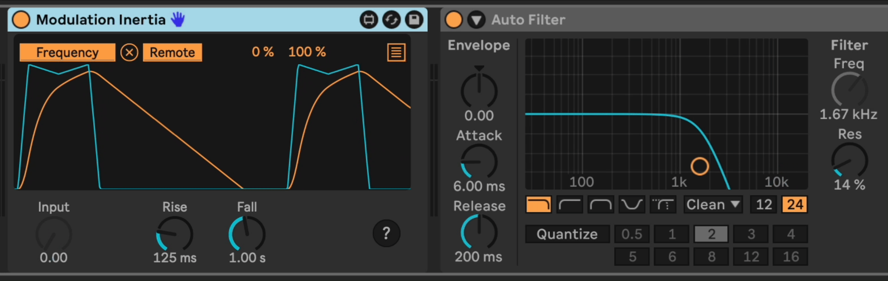

# Modulation Inertia

This is a utility device that provide some inertia to a modulation signal.

The blue line in the graph is the Input signal. The yellow line is the Output signal, which you would then map to other parameters in your Live Set.

In the example above, the Output signal is mapped to the filter frequency of the Auto Filter following it. The Input signal is quite sudden in its up and down movement, but Modulation Inertia smooths it out. It has the ability to apply different smoothing to rising and falling signals, which facilitates making things like an Attack-Decay envelope capability.

* *Input* - The input signal. Chances are you would map something to this knob.
* *Rise* - How much time the output signal should take to rise to a higher input value.
* *Fall* - The amount of time the output signal should fall to a lower input value.

Try setting Rise and Fall to medium values and move the Input knob rapidly to see this in action.

## Installation

Download the newest .amxd file from the Changelog section below, or clone this repository and drag the `Modulation Inertia.amxd` device into a track in Ableton Live.

## Changelog

* 2024-08-26 [v1](https://github.com/zsteinkamp/m4l-Modulation-Inertia/raw/main/frozen/Modulation%20Inertia%20v1.amxd) - Initial Release

## TODO

* ...

## Contributing

I'd love it if others extended this device. If you would like to contribute, simply fork this repo, make your changes, and open a pull request and I'll have a look.
